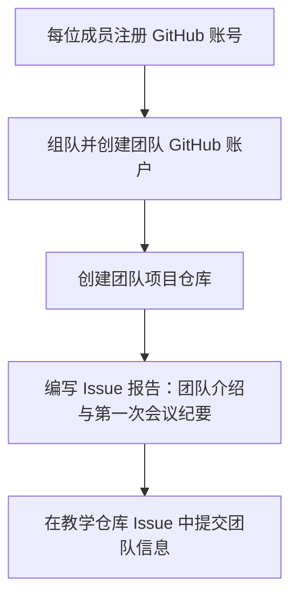

# 🧭 软件工程课程 GitHub 入门指南（学生与教师版）

本指南面向《构建之法》课程的所有同学和指导教师，旨在引导你完成 GitHub 账户注册、团队组建、项目仓库建立与首个报告编写等操作流程。

---

## ✍️ 任务总览

每位同学需完成以下步骤：

| 步骤编号 | 内容                                                         |
|----------|--------------------------------------------------------------|
| 1️⃣       | 注册个人 GitHub 账户并填写个人资料                             |
| 2️⃣       | 组成 3 人团队，确定团队名称并创建团队专属 GitHub 账户            |
| 3️⃣       | 在教学仓库的信息收集 Issue 中回复团队信息                        |
| 4️⃣       | 在团队仓库中编写第一篇报告（以 Issue 形式提交）                  |
| 5️⃣       | 阅读往年作品，参考经典讲义： [现代软件工程讲义目录](https://www.cnblogs.com/xinz/archive/2011/11/27/2265425.html) |

---

## 🧑‍💻 第一步：注册个人 GitHub 账号

1. 打开 [https://github.com](https://github.com)
2. 点击右上角 **Sign up**
3. 填写邮箱、用户名、密码，完成验证
4. 登录后请前往右上角头像 → **Settings** → **Public profile** 填写：
   - **Name**（中文或英文全名）
   - **Bio** 写上课程代号与小组（如：软件工程 A 班 - 第三组）

---

## 👥 第二步：组建团队并创建团队 GitHub 账户

> 每个团队需由 3 人组成，并创建一个专属的 **GitHub 团队账户（Organization 或普通账户皆可）**。

✅ 推荐创建普通团队账户步骤如下：

1. 用专门邮箱（如：`team123@example.com`）注册一个新的 GitHub 账户
2. 取一个清晰的用户名，如：`sw-team-delta`
3. 团队账户登录后创建一个公共仓库（public repository）：
   ```text
   Repository name: sw-project-demo
   Visibility: Public
   Initialize with README: ✅
   ```

🧠 注意事项：

- 团队 GitHub 账户 ≠ 个人 GitHub 账户；
- 所有团队成员需对该仓库拥有 **Write 权限**（可通过 Add Collaborators 添加）；
- 教师也可被添加为 Collaborator 以便查看和评论。

---

## 📋 第三步：在教学仓库提交团队信息

> 教师会预先创建课程教学仓库，并在其中建立"团队信息收集"Issue。学生需要在该 Issue 下回复提交团队信息。

参考样本：https://github.com/fanfeilong/how-to-develop/issues/1

### 操作步骤：

1. 进入教师提供的**课程教学仓库**
2. 找到标题为 **"第一个作业：团队信息收集 - 请各团队在此 Issue 下回复"** 的 Issue
3. 点击该 Issue，在评论区回复团队信息

### 回复模板：

请复制以下模板，填写您的团队信息后在 Issue 评论区回复：

```markdown
## 团队信息提交

**团队名称：** Team Delta

**团队成员信息：**
| 成员姓名 | 个人 GitHub ID | 个人 GitHub 链接 |
|----------|----------------|------------------|
| 张三     | zhangsan       | https://github.com/zhangsan |
| 李四     | lisi           | https://github.com/lisi     |
| 王五     | wangwu         | https://github.com/wangwu   |

**团队 GitHub 账户：** sw-team-delta  
**团队项目仓库：** https://github.com/sw-team-delta/sw-project-demo

**提交时间：** 2025-XX-XX
```

### 🤖 自动化优势：

- 📊 **集中管理**：所有团队信息汇总在一个 Issue 中
- 🔄 **API 支持**：教师可通过 GitHub Issues API 批量提取团队信息
- 📈 **数据处理**：支持自动化脚本整理学生名单、统计组队情况
- 🏷️ **标签管理**：可为不同班级/批次的回复添加标签分类

💡 **给教师的建议**：可以使用 GitHub Issues API 或第三方工具（如 Python 脚本）自动提取所有回复内容，生成班级花名册和团队统计表。

### 🤖 自动化脚本

本项目提供了完整的自动化脚本 `src/team_info_collector.py`，教师可以直接使用：

```bash
# 进入 src 目录
cd src

# 安装依赖
pip install -r requirements.txt

# 设置 GitHub Token（从 https://github.com/settings/tokens 获取）
export GITHUB_TOKEN=your_github_token_here

# 运行脚本收集团队信息
python team_info_collector.py --repo your-org/course-repo --issue 1 --output teams_2025

# 查看生成的 CSV 和 JSON 文件（默认在 data 目录）
ls ../data/teams_2025_*.csv ../data/teams_2025_*.json
```

**功能特性：**
- 📊 自动解析 Issue 中的团队信息回复
- 📈 数据验证和重复检查
- 💾 导出 CSV 和 JSON 格式报告
- 🔍 智能识别团队信息表格格式
- ⚠️ 异常处理和错误提示

**详细使用说明请参考 [团队信息收集脚本使用指南](./2.team_info_collector.md)**，包含完整的参数说明、高级功能和实际应用场景。

---

## 📝 第四步：提交团队第一篇报告（GitHub Issue）

GitHub Issue 可用作简洁的“项目日志、任务分解或开发日志”。

### 示例流程：

1. 进入团队仓库主页
2. 点击上方的 **Issues** → **New Issue**
3. 标题填写：
   ```
   团队首次报告 - 第一次会议纪要
   ```
4. 正文撰写可参考以下模板：

```markdown
## 🧑‍🤝‍🧑 团队组建信息

- 团队名称：Team Delta
- 组员：
  - 张三（项目负责人）
  - 李四（Git 管理员）
  - 王五（文档负责人）
- 团队 GitHub： https://github.com/sw-team-delta

## 📌 今日会议摘要（2025-XX-XX）

- 阅读任务：
  - 讲义：[现代软件工程讲义目录](https://www.cnblogs.com/xinz/archive/2011/11/27/2265425.html)
  - 参考项目：https://github.com/上一届同学的项目链接
- 分工设定：
  - 张三负责项目初始化与目录结构
  - 李四负责 GitHub CI 流程配置
  - 王五负责调研报告与 API 设计草图

## ✅ 下一步任务（待完成）

- 创建项目计划表
- 配置开发环境（Python / VSCode / Docker）
- 编写第一个 Demo 模块
```

提交后，该 Issue 即成为你们的团队 “第一次项目报告”。

---

## 🔁 完整工作流程图



---

## 🧩 常见问题 FAQ

| 问题                             | 解答                                                              |
|----------------------------------|-------------------------------------------------------------------|
| 是否每位同学都要注册 GitHub？     | ✅ 是，必须每人一个账户                                             |
| 团队仓库必须是 public 吗？        | 推荐 public 便于同学间互访与展示，如果含敏感代码可临时设为 private |
| 不懂 GitHub 操作怎么办？          | 建议阅读：[Git 入门教程](https://rogerdudler.github.io/git-guide/index.zh.html)（简体中文版） |
| 可以用网页直接编辑代码吗？        | ✅ GitHub 支持在网页上修改文件与撰写 Issue，无需本地安装 Git       |

---

## 💡 补充建议

- 在团队仓库开启 **Projects** 或使用 GitHub Issues Track 任务列表（用于敏捷开发）
- 每周汇报会议可用一个新 Issue 记录，与老师/助教保持在线同步
- 建议在 README 中加入联系方式、项目简介、任务路线图等
