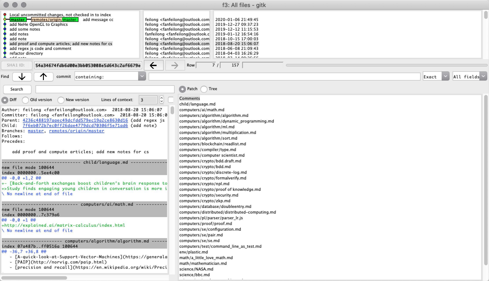

本文原始链接：https://www.cnblogs.com/math/p/git.html

# Git 目录（Table of Contents, TOC）

- [0x01 基础教程](#0x01-基础教程)
- [0x02 使用.gitignore忽略不应该提交到git仓库的文件](#0x02-使用gitignore忽略不应该提交到git仓库的文件)
- [0x03 分支流程](#0x03-分支流程)
- [0x04 提交日志](#0x04-提交日志)
- [0x05 变化比较](#0x05-变化比较)
- [0x06 团队协作](#0x06-团队协作)
- [0x07 高级用法](#0x07-高级用法)
- [0x08 常见问题(FAQ)](#0x08-常见问题faq)
- [0x09 掌握Git的秘诀](#0x09-掌握git的秘诀)

## 0x01 基础教程

#### A. 先随便看看
首先，这是一组根据链接难度和相关性组织的懒人图解学习包：
- [Git简明指南](http://rogerdudler.github.io/git-guide/index.zh.html)
  - [Git核心概念](https://lufficc.com/blog/the-core-conception-of-git)
    - [Git clone/add/commit/fetch/diff/pull/pull -rebase 图解](https://rachelcarmena.github.io/2018/12/12/how-to-teach-git.html)
       - [Git 分支图解](http://www.lurklurk.org/gitpix/gitpix.html)
         - [如果你喜欢step by step完整掌握操作，并且愿意阅读英文指南，请看这个：Git how to](https://githowto.com/)

#### B. 2/8原则
* 记住**2/8原则**，入门先掌握下面这几个命令即可。
* 当然欢迎你深度阅读本文的所有资料，毕竟你是一个正在成长中的对技术充满了好奇的探索者：
```bash
git clone xx （克隆远程仓库到本地）
git pull  （拉取远程仓库代码更新）
git push （推送本地代码更新到远程）
git add .  （添加所有变动）
git commit -m "xxx" （提交，xxx是提交日志）
git log --oneline （单行显示git 日志）
git status（这个命令应该反复使用，用来确认你本地git仓库变动了什么）
```

#### C. 你还是要理解git大概怎么干活的

其次，需要推荐[Git Data Transport Command](http://blog.osteele.com/2008/05/my-git-workflow/)里的这张图，一图读懂Git的数据传输流程，对于通过理解来记忆命令非常有好处。为了便于修订和添加，我重新制作了这张图：


#### D. 但是图解也是充满歧义的，再消化下吧

最后，[@SoftwareTeacher](https://www.cnblogs.com/xinz/)提到了上图中的`workspace/index/local repository`三者都是用户在自己本机上的代码，比较让初学者困惑。我们可以对照下中英文术语解释下：
* **workspace，中文术语：工作区。就是本地代码目录下除去`.git`文件夹外的文件**，这部分代码的任何变动通过`git status`可以看到是<span style="color:red">红色</span>标示的。
* **index，也叫stage area，中文术语：暂存区。暂存区域是一个文件，一般在.git目录中**，保存了下次将提交的文件列表信息。在暂存区，还未提交到版本库的文件，通过`git status`可以看到是<span style="color:green">绿色</span>标示的。
* **local repository，中文术语：本地版本库。就是代码目录下的.git目录**。本地版本库和暂存区的元数据都存储在.git目录下。本地版本库里含有本地创建的各个分支索引，以及远程版本库分支的索引信息。在local repository上的操作默认是针对当前分支。
* **remote repository，中文术语：远程版本库**。就是 `Github`/`Gitee` 或者自己搭建的代码托管服务器上的代码仓库。

把本地代码分为三个区，是git的一个特色，是一种解决本地复杂代码修改变动管理的方案，[Git的基本操作在这三个区之间](https://git-scm.com/book/zh/v2/%E8%B5%B7%E6%AD%A5-Git-%E5%9F%BA%E7%A1%80)：
* 在工作目录中修改文件。
* 暂存文件，将文件的快照放入暂存区域。
* 提交更新，找到暂存区域的文件，将快照永久性存储到 Git 仓库目录。

## 0x02 使用.gitignore忽略不应该提交到git仓库的文件

git源码目录下的每个文件夹下都可以添加名为`.gitignore`的文本文件，在这个名字的文件里使用文件路径通配符写上需要忽略的文件，这些忽略的文件不会提交到git。常见的不应该提交到git的文件有这些：
* 某个平台特定的系统索引文件，例如MacOS下的`.DS_Store`文件
* 缓存文件，例如`.*.swp`
* IDE/编辑器的配置文件，例如VisualStudioCode的`.vscode`文件
* 编译器生成的bin目录，obj目录等
* 某种语言的第三方依赖库，例如nodejs的`node_modules`目录
* 某种前端框架的编译输出目录，例如`dist`目录
* 某种格式文件的缓存文件，例如Word文件的`~$*.docx`

除了自己编写，你也可以使用通用的`.gitignore`文件，例如，这个网站[gitignore.io](http://www.gitignore.io/)上，你可以输入平台、语言的名字生成默认的忽略文件，操作如图所示：
<div style="display: flex; gap: 10px;">
  
  
</div>


一个常见的问题是：<span style="color:red">**如果不小心添加了文件并提交到git仓库了怎么办？**</span>，操作步骤如下：
1. 首先添加路径到.gitignore文件
2. 其次将其从git里删除，删除有两种，一种是删除目录，一种是删除文件，分别添加-r或者-f选型，其中--cached表示从暂存区删除，如果不加--cached，则本地工作区里文件也被删除，参考上一节的分区图片。
```
# 删除目录用-r选项
git rm --cached path_to_dir -r

# 删除文件用-f选项
git rm --cached path_to_file -f

# 添加日志并生成一个git commit
git commit -m 'delete remote somefile'

# 提交到远程仓库
git push
```

## 0x03 分支流程
- 分支操作的基本命令：
    * `git checkout -b <name>`  可以创建出一个名为`name`的分支
    * `git checkout <name>` 可以切换到名为`name`的分支
    * `git branch`，用来显示本地有哪些分支，用`*`号标示的就是当前分支。当你在分支之间做`git merge`或者`git rebase`，以及在远程版本库和本地版本库之间做`git pull`或者`git pull --rebase`时，遇到冲突的时候，查看状态最重要的两个命令就是`git status`和`git branch`。
    * `git branch -a`，用来显示本地的分支以及已经同步的远程分支列表。通过`git fetch`可以把还没有同步到本地的远程分支索引同步下来，再通过`git branch -a`就可以看到。
- 图解Github的PullRequest开发方式：[Understanding the GitHub Flow](https://guides.github.com/introduction/flow/)
  - 一种成功的git分支策略：[A successful Git branching model](http://nvie.com/posts/a-successful-git-branching-model/)
    - 在线交互式的方式学习Git的分支，只需要鼠标点击即可学习：[learn git branching](https://learngitbranching.js.org)

## 0x04 提交日志
- 基本命令：
    - git commit -m 'message'
- 如何写好git的提交日志：[How to Write a Git Commit Message](http://chris.beams.io/posts/git-commit/)
  - 保持提交历史的干净、整洁：[Keeping Commit Histories Clean](https://www.reviewboard.org/docs/codebase/dev/git/clean-commits/)
    - [Commit message 和 Change log 编写指南](http://www.ruanyifeng.com/blog/2016/01/commit_message_change_log.html)
      - [Git提交信息撰写风格](http://blog.shengbin.me/posts/git-commit-message-writing-style)

## 0x05 比较｜可视化
- Visual Studio Code编辑器对Git Diff十分友好：[配置](https://stackoverflow.com/questions/30024353/how-to-use-visual-studio-code-as-default-editor-for-git) 
    - [SublimeMerge用来管理查看多分支状态，以及合并/rebase也十分直观方便](https://www.sublimemerge.com/)
        - 通过`git bisect` 二分排除法来定位哪次提交出现问题: [git bisect](http://www.ruanyifeng.com/blog/2018/12/git-bisect.html)
- [使用GIT自带的GITK可视化](https://git-scm.com/docs/gitk)，命令：`gitk`


## 0x06 团队协作
- [GitHub团队项目合作流程](http://www.cnblogs.com/schaepher/p/4933873.html)
- [Github团队开发示例](http://www.cnblogs.com/greyzeng/p/6044837.html)

## 0x07 高级用法
- 最佳实践、本文略晦涩、慎入：[Commit Often, Perfect Later, Publish Once: Git Best Practices](https://sethrobertson.github.io/GitBestPractices/)
- [git内部如何工作，十分简洁地把git内部的Objects和Refs的关系讲解清楚](https://www.linkedin.com/pulse/git-internals-how-works-kaushik-rangadurai)
    - [git内部实现剖析，一个Web幻灯片，讲解GitObjects更多的内部细节](https://blog.isquaredsoftware.com/presentations/2019-03-git-internals-rewrite)
        - [git-internals-pdf，十分详细完整优美的Git内部结构的文档，图文并茂](https://github.com/pluralsight/git-internals-pdf)
            - [git是纯函数数据结构，一种思考git的方式](https://blog.jayway.com/2013/03/03/git-is-a-purely-functional-data-structure/)
                - [git大文件管理，git-lfs](https://git-lfs.github.com/)

<div style="display: flex; gap: 10px;">
  
  
</div>

## 0x08 常见问题(FAQ)

**状态查看**：
<span style="color:red">Q：为什么`git status`的使用频率很高？</span>
A：git status是最高频的命令，用来查看当前状态以确认发生了什么，主要是下面三种常见情况：
* 红色的是workspace里新发生的变动。
* 绿色的是已经执行过git add，从workspace添加到index的变动。
* 解决冲突中当前冲突解决的状态

**日志**:

<span style="color:red">Q: 最常用的日志命令？</span>
A: `git log --oneline` 单行方式查看日志，更复杂的直接去网页上看，或者让大模型给你生成日志查看命令，你提需求。

**分支**：

<span style="color:red">Q：如何查看所有分支</span>
A：`git branch -a`

<span style="color:red">Q：如何切换到别的分支</span>
A: `git checkout other_branch_name`

<span style="color:red">Q: 如何从别到分支合并到当前分支</span>
A: `git merge other_branch_name`

<span style="color:red">Q: 如何以别的分支为基准在当前分支上重做</span>
A：`git rebase other_branch_name`

**提交**：

<span style="color:red">Q：代码修改一半，需要临时更新代码修改一个BUG怎么办?</span>
A：把当前代码临时放到stash stack里：
* 入栈：`git stash`
* 更新，修改并提交：
  * `git pull --rebase`
  * do something
  * `git add .`
  * `git commit -m 'fix bug' `
  * `git push origin master`
* 出栈：`git stash pop`

**冲突**:
<span style="color:red">Q: 遇到冲突的时候，如何只使用自己的版本？</span>
A: 取决于是merge还是rebase，在merge中`--ours`表示自己的版本，`--theirs`表示对方的版本，而rebase时相反，rebase顾名思义指以对方的版本为基准版本。
* merge:
  * `git merge other_branch_name`
  * 在merge中，使用自己的版本是:`git checkout --ours`，使用对方的版本是`git checkout --theirs`，两者都需要则要通过diff工具比对合并。
  * `git merge --continue`
* rebase:
  * `git rebase other_branch_name`
  * 在merge中，使用自己的版本是:`git checkout --theirs`，使用对方的版本是`git checkout --ours`，两者都需要则要通过diff工具比对合并。
  * `git rebase --continue`
* merge和rebase哪个好？
  * [观点：rebase是有害的](https://www.fossil-scm.org/fossil/doc/trunk/www/rebaseharm.md)一种流行的说法是`git rebase`可以让历史记录显的更干净，但是这篇文章揭示了rebase本质上是merge后把被merge节点的来源忽略了，文章认为这实际上会使得commit节点的历史记录丢失了，让历史记录显的更干净的做法应该是提供一个更好的显示策略和工具，而不是直接在索引里把元数据丢掉。
  * merge和rebase的节点变动对比：


<span style="color:red">Q: `git pull`和`git pull --rebase`的区别是什么？</span>
A：记住下面的几条
* `git pull=git fetch+git merge`
* `git pull --rebase=git fetch+git rebase`
* 所以在两种情况下的冲突的解决分别和`merge`和`rebase`相同。
* 如果想配置默认使用git pull --rebase，执行命令: `git config --global pull.rebase true`

<span style="color:red">Q：`git cherry_pick`怎么用？</span>
A：如果你想把分支A上的一个commit提取出来添加到分支B上，基本步骤是：
* 通过`git checkout A`切换到A分支
  * 通过`git log --oneline -n10`查看A分支上最近N条记录(这里是查看了10条)，复制你需要提取的那个commit的哈希例如是7f6eb072b7e。
* 通过`git checkout B`切换到B分支
  * 通过`git cherry_pick 7f6eb072b7e`将哈希值7f6eb072b7e对应的那个commit作用到当前分支，也就是分支B。
  * 如果有冲突，你需要解决下冲突。
* 应该尽量少用cherry-pick，主要是 git cherry-pick 设计上会导致后续合并的问题:https://devblogs.microsoft.com/oldnewthing/20180312-00/?p=98215

<span style="color:red">Q: 中文文件名显示成了8进制？</span>
A: `git config --global core.quotepath false`

<span style="color:red">Q: 如果远程仓库里有大文件，clone不下来怎么办？</span>
A: 此时会报错：`fatal: protocol error: bad pack header`，解决办法就是浅克隆一层原始仓库，然后设置远程仓库为目标分支，再浅层fetch下目标分支，然后checkout切过去。
```bash
git clone --depth 1 https://xxx.git
git remote set-branches origin 'remote_branch_name'
git fetch --depth 1 origin remote_branch_name
git checkout remote_branch_name
```

## 0x09 掌握Git的秘诀

首先，我学习 git/svn/latex 之类的，基本做法是**理解背后的原理**，然后使用的过程中**随时查手册**，久了就通过肌肉记忆自然熟悉。像这里是[latex的索引](http://www.cnblogs.com/math/p/latex.html)，但是我现在编辑latex比较少，有时候排版书籍的时候用的时候会去更新下。

其次，坚持**使用git命令行**来处理日常工作，**学习git的原子指令**。如果使用GUI，会习惯GUI的操作，但是对于git本身的常用操作会生疏，甚至不理解一个GUI复合了哪些原子的操作，出现问题的时候到底是哪个环节出问题。

以及，**工欲善其事，必先利其器，即使是使用git命令本身，也有利器辅助**。我用了`N=(14)`年多Mac系统，有一个历史命令自动完成的工具，叫[fishshell](https://fishshell.com/)，通过fish，我只要敲前面几个字母，后面就会灰色自动完成，上下键可以切换同类的敲过的高频命令，按向右的方向键自动完成。通过这种方式，我又比别人减少了大量输入错误导致的命令学习障碍，极大增加成功率。

最后，**AI大模型善于写命令行**，不熟悉的也可以让大模型生成命令给你用，还有Cursor这种IDE可以在IDE内的终端里Ctrl+k调出大模型对话框写需求生成命令行直接输入到终端里，出错再反馈给它修复就好。
