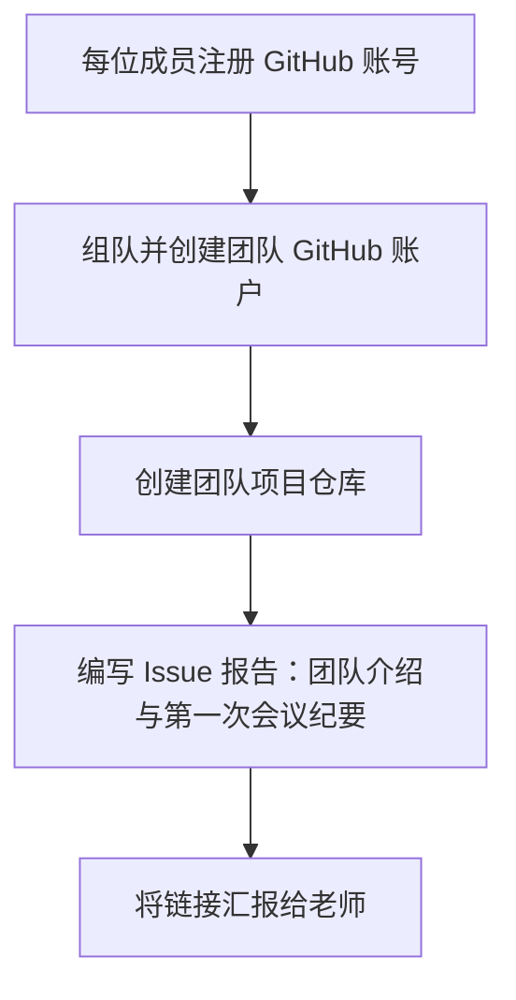

当然可以！以下是一篇适用于软件工程课程的 GitHub 使用指南，专为学生和教师准备，完整介绍了项目协作、账户管理、团队仓库与首个 Issue 报告的编写方式。你可以将其保存为项目仓库中的 `README.md`，供全班参考：

---

# 🧭 软件工程课程 GitHub 入门指南（学生与教师版）

本指南面向《构建之法》课程的所有同学和指导教师，旨在引导你完成 GitHub 账户注册、团队组建、项目仓库建立与首个报告编写等操作流程。

---

## ✍️ 任务总览

每位同学需完成以下步骤：

| 步骤编号 | 内容                                                         |
|----------|--------------------------------------------------------------|
| 1️⃣       | 注册个人 GitHub 账户并填写个人资料                             |
| 2️⃣       | 组成 3 人团队，确定团队名称并创建团队专属 GitHub 账户            |
| 3️⃣       | 向老师报告团队成员名单、GitHub ID、团队 GitHub 地址             |
| 4️⃣       | 在团队仓库中编写第一篇报告（以 Issue 形式提交）                  |
| 5️⃣       | 阅读往年作品，参考经典讲义： [现代软件工程讲义目录](https://www.cnblogs.com/math) |

---

## 🧑‍💻 第一步：注册个人 GitHub 账号

1. 打开 [https://github.com](https://github.com)
2. 点击右上角 **Sign up**
3. 填写邮箱、用户名、密码，完成验证
4. 登录后请前往右上角头像 → **Settings** → **Public profile** 填写：
   - **Name**（中文或英文全名）
   - **Bio** 写上课程代号与小组（如：软件工程 A 班 - 第三组）

---

## 👥 第二步：组建团队并创建团队 GitHub 账户

> 每个团队需由 3 人组成，并创建一个专属的 **GitHub 团队账户（Organization 或普通账户皆可）**。

✅ 推荐创建普通团队账户步骤如下：

1. 用专门邮箱（如：`team123@example.com`）注册一个新的 GitHub 账户
2. 取一个清晰的用户名，如：`sw-team-delta`
3. 团队账户登录后创建一个公共仓库（public repository）：
   ```text
   Repository name: sw-project-demo
   Visibility: Public
   Initialize with README: ✅
   ```

🧠 注意事项：

- 团队 GitHub 账户 ≠ 个人 GitHub 账户；
- 所有团队成员需对该仓库拥有 **Write 权限**（可通过 Add Collaborators 添加）；
- 教师也可被添加为 Collaborator 以便查看和评论。

---

## ✉️ 第三步：向教师汇报信息（建议发送邮件 / 建立文档）

请将以下信息提交给授课教师：

- 团队名称：
- 三位组员姓名：
- 三位组员 GitHub ID（个人）：
- 团队 GitHub ID（团队账户）：
- 团队项目仓库地址（URL）：

💡 建议用 Markdown 表格整理如下：

| 成员姓名 | 个人 GitHub ID | 个人 GitHub 链接        |
|----------|----------------|--------------------------|
| 张三     | zhangsan       | https://github.com/zhangsan |
| 李四     | lisi           | https://github.com/lisi     |
| 王五     | wangwu         | https://github.com/wangwu   |

团队仓库地址示例：  
`https://github.com/sw-team-delta/sw-project-demo`

---

## 📝 第四步：提交团队第一篇报告（GitHub Issue）

GitHub Issue 可用作简洁的“项目日志、任务分解或开发日志”。

### 示例流程：

1. 进入团队仓库主页
2. 点击上方的 **Issues** → **New Issue**
3. 标题填写：
   ```
   团队首次报告 - 第一次会议纪要
   ```
4. 正文撰写可参考以下模板：

```markdown
## 🧑‍🤝‍🧑 团队组建信息

- 团队名称：Team Delta
- 组员：
  - 张三（项目负责人）
  - 李四（Git 管理员）
  - 王五（文档负责人）
- 团队 GitHub： https://github.com/sw-team-delta

## 📌 今日会议摘要（2025-XX-XX）

- 阅读任务：
  - 讲义：[现代软件工程讲义目录](https://www.cnblogs.com/math)
  - 参考项目：https://github.com/上一届同学的项目链接
- 分工设定：
  - 张三负责项目初始化与目录结构
  - 李四负责 GitHub CI 流程配置
  - 王五负责调研报告与 API 设计草图

## ✅ 下一步任务（待完成）

- 创建项目计划表
- 配置开发环境（Python / VSCode / Docker）
- 编写第一个 Demo 模块
```

提交后，该 Issue 即成为你们的团队 “第一次项目报告”。

---

## 🔁 完整工作流程图



---

## 🧩 常见问题 FAQ

| 问题                             | 解答                                                              |
|----------------------------------|-------------------------------------------------------------------|
| 是否每位同学都要注册 GitHub？     | ✅ 是，必须每人一个账户                                             |
| 团队仓库必须是 public 吗？        | 推荐 public 便于同学间互访与展示，如果含敏感代码可临时设为 private |
| 不懂 GitHub 操作怎么办？          | 建议阅读：[Git 入门教程](https://rogerdudler.github.io/git-guide/index.zh.html)（简体中文版） |
| 可以用网页直接编辑代码吗？        | ✅ GitHub 支持在网页上修改文件与撰写 Issue，无需本地安装 Git       |

---

## 💡 补充建议

- 在团队仓库开启 **Projects** 或使用 GitHub Issues Track 任务列表（用于敏捷开发）
- 每周汇报会议可用一个新 Issue 记录，与老师/助教保持在线同步
- 建议在 README 中加入联系方式、项目简介、任务路线图等
